# HackerRank Solutions

A collection of solutions to HackerRank problems, primarily focused on the **Interview Preparation Kit**. Solutions are implemented in multiple programming languages with detailed explanations for selected problems.

## Overview

```mermaid
graph TD
    subgraph Languages["Supported Languages"]
        P["Python 🐍"]
        JS["JavaScript 📜"]
        C["C ⚡"]
        R["Rust 🦀"]
        SQL["MySQL 🗄️"]
    end

    subgraph Categories["Problem Categories"]
        A["Arrays"]
        D["Dictionaries & Hashmaps"]
        S["Sorting"]
        ST["String Manipulation"]
        G["Greedy Algorithms"]
        GE["General"]
        DB["Database Queries"]
    end

    Languages --> Categories
```



## Repository Structure

```
hackerrank/
├── python/                          # Primary language (24 solutions)
│   └── interview_preparation_kit/
│       ├── arrays/
│       ├── dictionaries_and_hashmaps/
│       ├── general/
│       ├── greedy_algorithms/
│       ├── sorting/
│       └── string_manipulation/
├── JavaScript/                      # 8 solutions
│   └── interview_preparation_kit/
│       ├── arrays/
│       └── general/
├── C/                               # 8 solutions
│   └── interview_preparation_kit/
│       ├── arrays/
│       └── general/
├── Rust/                            # 7 solutions
│   └── interview_preparation_kit/
│       ├── arrays/
│       └── general/
└── MySQL/                           # 8 solutions (SQL queries)
```

## Problem Coverage

### By Language

| Language   | Solutions | Categories | Status |
|------------|-----------|------------|--------|
| Python     | 24        | 6          | Most comprehensive |
| JavaScript | 8         | 2          | Arrays, General |
| C          | 8         | 2          | Arrays, General |
| Rust       | 7         | 2          | Arrays, General |
| MySQL      | 8         | 1          | SQL Queries |

### By Category (Python)


| Category | Problems |
|----------|----------|
| Arrays | 2D Array DS, Left Rotation, New Year Chaos, Minimum Swaps, Array Manipulation, Count Triplets, Frequency Queries |
| Sorting | Bubble Sort, Mark and Toys, Comparator, Fraudulent Activity Notifications, Merge Sort Counting Inversions |
| String Manipulation | Making Anagrams, Alternating Characters, Sherlock and Valid String, Special String Again |
| General | Repeated String, Counting Valleys, Sales by Match, Jumping on the Clouds |
| Dictionaries & Hashmaps | Ransom Note, Two Strings, Sherlock and Anagrams |
| Greedy Algorithms | Luck Balance |

## Getting Started

### Python

```bash
cd python

# Using uv (recommended)
uv sync

# Run a solution
python interview_preparation_kit/arrays/problem_1_2D_array_DS.py
```

### JavaScript

```bash
cd JavaScript

# Run a solution
node interview_preparation_kit/arrays/problem_1_2D_array_DS.js
```

### C

```bash
cd C/interview_preparation_kit/arrays

# Compile and run
gcc -o solution problem_1_2D_array_DS.c
./solution
```

### Rust

```bash
cd Rust/interview_preparation_kit/arrays

# Compile and run
rustc problem_1_repeated_string.rs
./problem_1_repeated_string
```

### MySQL

SQL files can be executed in any MySQL-compatible environment or tested on HackerRank directly.

## Solution Format

Each solution follows a consistent structure:

```python
# Problem: [Category] - [Problem Name]
# Link: https://www.hackerrank.com/challenges/[problem-slug]/problem

def solution_function(params):
    # Implementation
    pass

if __name__ == "__main__":
    # Example usage with test cases
    pass
```

## Documented Solutions

Some problems include detailed tutorials with step-by-step explanations:

| Problem | Tutorial |
|---------|----------|
| Making Anagrams | [Tutorial](python/interview_preparation_kit/string_manipulation/problem_1_Making_Anagrams.md) |
| Luck Balance | [Tutorial](python/interview_preparation_kit/greedy_algorithms/problem_1_Luck_Balance.md) |

## Complexity Reference

Common time complexities found in solutions:

```mermaid
graph LR
    subgraph Optimal["Target Complexities"]
        O1["O(1) - Constant"]
        ON["O(n) - Linear"]
        ONLOGN["O(n log n) - Linearithmic"]
    end

    subgraph Acceptable["Sometimes Necessary"]
        ON2["O(n²) - Quadratic"]
        ONK["O(n × k) - Depends on k"]
    end
```



## Contributing

1. Follow the existing naming convention: `problem_N_Problem_Name.ext`
2. Include the problem link in comments
3. Add example usage in `main`
4. Document time/space complexity

## Resources

- [HackerRank Interview Preparation Kit](https://www.hackerrank.com/interview/interview-preparation-kit)
- [Python Documentation](https://docs.python.org/3/)
- [Big-O Cheat Sheet](https://www.bigocheatsheet.com/)

## License

This repository is for educational purposes. Solutions are meant to help understand algorithms and data structures.
