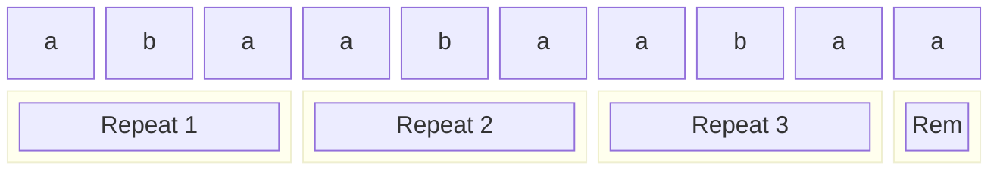

# Repeated String - Tutorial

## Problem Statement

Given a string `s` that is repeated infinitely, count how many letter **'a'** appear in the first `n` characters.

**Link:** [HackerRank - Repeated String](https://www.hackerrank.com/challenges/repeated-string/problem)

---

## Understanding the Problem

**Input:**
- `s`: A string to be repeated infinitely
- `n`: The number of characters to consider

**Output:**
- Count of 'a' in the first `n` characters of the infinite string

### Example

```
s = "aba"
n = 10
```

Infinite string: `abaabaabaa...`
First 10 chars: `abaabaabaa`
Count of 'a': **7**

---

## The Naive Approach (Don't Do This)

```python
# BAD: O(n) time and space - will crash for large n
def repeatedString_naive(s, n):
    infinite_string = (s * (n // len(s) + 1))[:n]
    return infinite_string.count("a")
```

**Why it's bad:**
- When `n = 10^12`, this tries to create a trillion-character string
- Memory error guaranteed
- Even if it fit in memory, O(n) iteration is too slow

---

## The Optimal Solution

```python
def repeatedString(s, n):
    a_count_in_string = s.count("a")
    num_full_repeats, remaining_length = divmod(n, len(s))
    total_repeats = num_full_repeats * a_count_in_string + s[:remaining_length].count("a")
    return total_repeats
```

### Key Insight

Instead of building the string, use **math**:

1. Count 'a's in one copy of `s`
2. Calculate how many full copies of `s` fit in `n` characters
3. Handle the partial remainder separately

---

## Step-by-Step Breakdown

### Example: `s = "aba"`, `n = 10`

**Step 1:** Count 'a's in original string
```
s = "aba"
a_count_in_string = 2
```

**Step 2:** Calculate full repeats and remainder
```
n = 10
len(s) = 3

divmod(10, 3) = (3, 1)
  ↓
num_full_repeats = 3      # "aba" fits 3 complete times
remaining_length = 1      # 1 character left over
```

**Step 3:** Visualize what we're counting



**Step 4:** Calculate total
```
Full repeats contribution: 3 × 2 = 6 'a's
Remainder "a" contribution: 1 'a'
Total: 6 + 1 = 7
```

---

## Complexity Analysis

| Metric | Value | Explanation |
|--------|-------|-------------|
| **Time** | O(len(s)) | Only iterate through `s` twice (two `.count()` calls) |
| **Space** | O(1) | No extra space proportional to input |

**Why this matters:** When `n = 10^12` but `len(s) = 100`, we do ~200 operations instead of a trillion.

---

## Edge Cases

```python
# Empty string
repeatedString("", 10)  # Division by zero! Need to handle

# No 'a's in string
repeatedString("bcd", 100)  # Returns 0

# String is all 'a's
repeatedString("aaa", 10)  # Returns 10

# n smaller than len(s)
repeatedString("abcabc", 3)  # Only counts first 3 chars
```

---

## Improved Solution with Edge Case Handling

```python
def repeatedString(s, n):
    # Edge cases
    if not s or n <= 0:
        return 0

    a_count = s.count("a")

    # If no 'a's exist, return early
    if a_count == 0:
        return 0

    # If string is all 'a's, answer is simply n
    if a_count == len(s):
        return n

    full_repeats, remainder = divmod(n, len(s))

    return full_repeats * a_count + s[:remainder].count("a")
```

---

## Alternative: Single Pass Solution

The original solution calls `.count()` twice. We can do it in a single pass:

```python
def repeatedString_single_pass(s, n):
    if not s:
        return 0

    full_repeats, remainder = divmod(n, len(s))

    total_a = 0
    remainder_a = 0

    for i, char in enumerate(s):
        if char == 'a':
            total_a += 1
            if i < remainder:
                remainder_a += 1

    return full_repeats * total_a + remainder_a
```

### Comparison

| Solution | Passes | Time | Practical Speed |
|----------|--------|------|-----------------|
| Original | 2 | O(len(s)) | Faster (C-optimized `.count()`) |
| Single Pass | 1 | O(len(s)) | Slower (Python loop overhead) |

**Verdict:** The original is actually faster in practice because `.count()` is implemented in C, while a Python `for` loop has more overhead. Stick with the original.

---

## Alternative: Using sum() with Generator

A more Pythonic one-liner (but not necessarily faster):

```python
def repeatedString_pythonic(s, n):
    if not s:
        return 0

    full, rem = divmod(n, len(s))
    return full * s.count("a") + sum(1 for c in s[:rem] if c == 'a')
```

---

## Common Mistakes

1. **Building the actual repeated string**
   - Don't: `(s * n)[:n].count("a")`
   - This crashes for large `n`

2. **Integer overflow concerns**
   - Python handles big integers natively, so `n = 10^12` is fine
   - In other languages (C, Java), use `long` types

3. **Off-by-one in remainder**
   - `s[:remainder]` is correct (slicing is exclusive of end index)
   - `s[:remainder+1]` would be wrong

4. **Forgetting empty string edge case**
   - `divmod(n, 0)` raises `ZeroDivisionError`

---

## Test Cases

```python
# Basic cases
assert repeatedString("aba", 10) == 7
assert repeatedString("a", 1000000000000) == 1000000000000

# Edge cases
assert repeatedString("b", 100) == 0
assert repeatedString("aaa", 10) == 10
assert repeatedString("abc", 1) == 1
assert repeatedString("abc", 2) == 1
assert repeatedString("abc", 3) == 1
assert repeatedString("abc", 4) == 2  # "abca"
```

---

## Key Takeaways

1. **Math over iteration** - When dealing with repeated patterns, use division to count full repetitions

2. **divmod is your friend** - Returns both quotient and remainder in one operation

3. **Don't materialize large data** - If `n` is huge, never try to create a string of length `n`

4. **Built-in methods are fast** - `.count()` in Python is C-optimized; don't replace it with Python loops unless necessary

5. **Handle edge cases first** - Empty strings, zero counts, and boundary conditions

---

## Related Problems

- [Jumping on the Clouds](https://www.hackerrank.com/challenges/jumping-on-the-clouds)
- [Counting Valleys](https://www.hackerrank.com/challenges/counting-valleys)
- [Sales by Match](https://www.hackerrank.com/challenges/sock-merchant)
