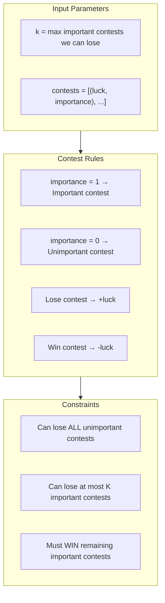
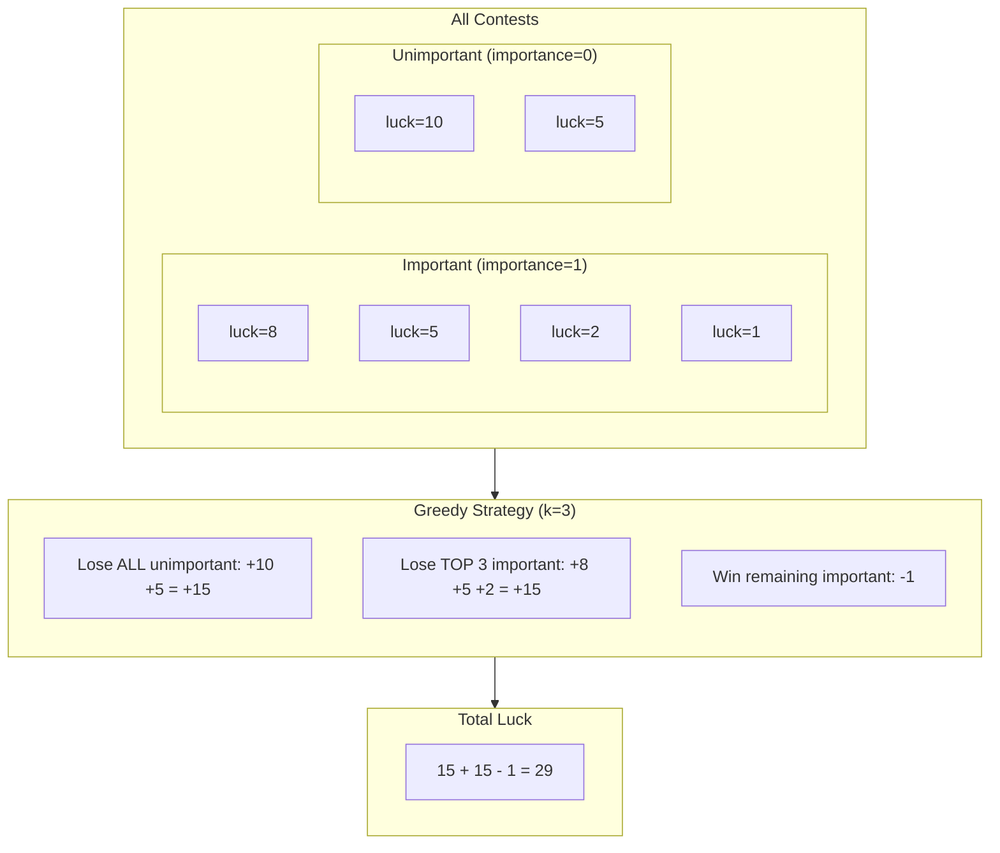
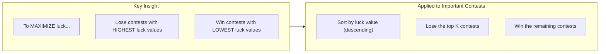
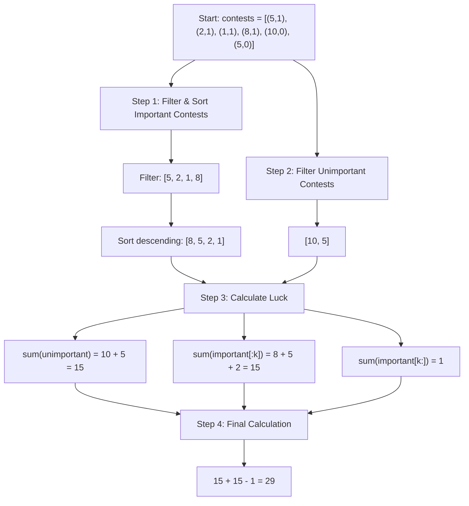
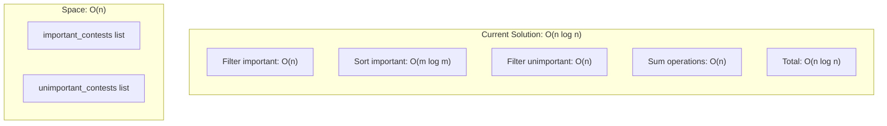
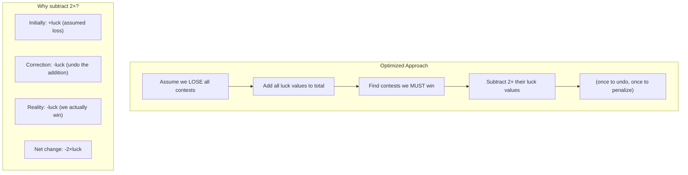
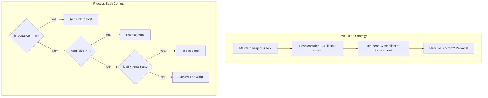
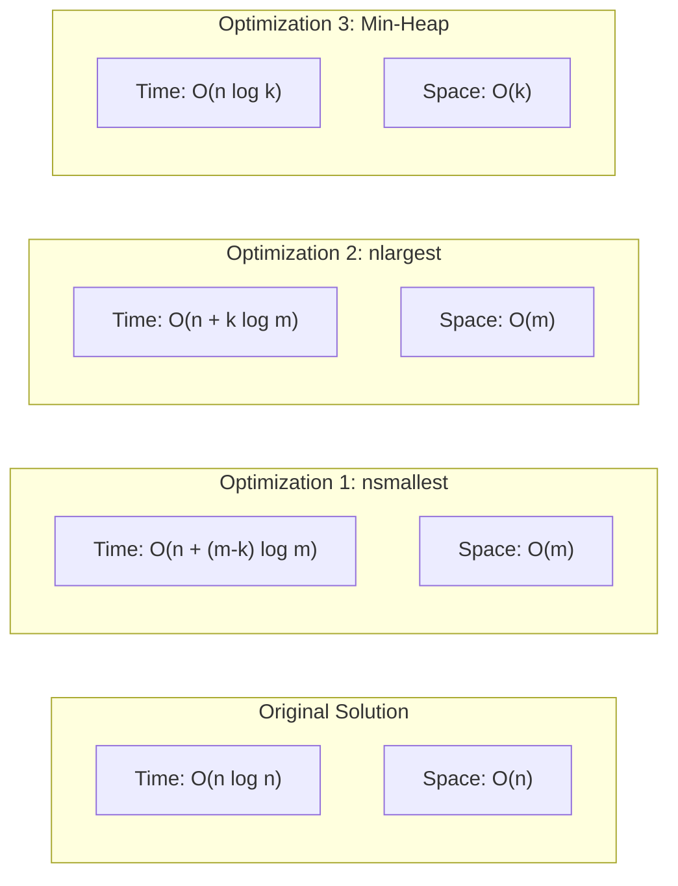
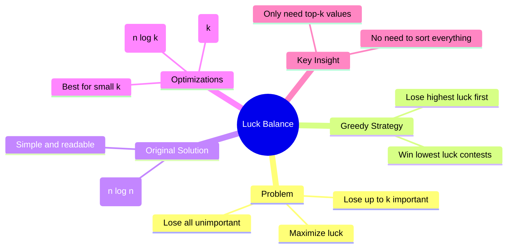
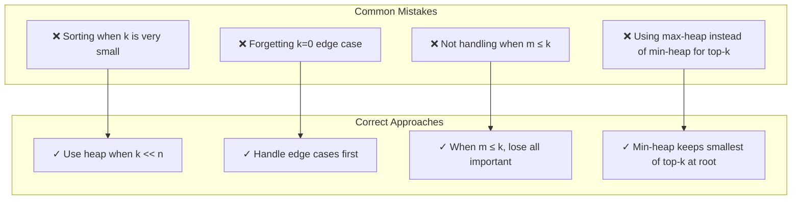

# Luck Balance - Tutorial

## Problem Statement

Lena is preparing for an important coding competition. Before the competition, she must attend several preliminary contests. Each contest has a **luck value** and an **importance rating**.

- If Lena **loses** a contest, she gains that contest's luck value
- If Lena **wins** a contest, she loses that luck value
- She can lose at most **k important contests**
- She can lose **all unimportant contests**

**Goal:** Maximize total luck.

**Link:** [HackerRank - Luck Balance](https://www.hackerrank.com/challenges/luck-balance/problem)

---

## Understanding the Problem



---

## Example Walkthrough

```
k = 3
contests = [(5, 1), (2, 1), (1, 1), (8, 1), (10, 0), (5, 0)]
```



---

## The Greedy Insight



**Why is this greedy?**
- We make the locally optimal choice at each step
- Losing high-luck contests gives us more luck
- Being forced to win should cost us the least (low-luck contests)

---

## Current Solution Analysis

```python
# O(n log n) time complexity due to sorting
def luckBalance(k, contests):
    important_contests = sorted(
        [luck for luck, importance in contests if importance == 1],
        reverse=True
    )
    unimportant_contests = [luck for luck, importance in contests if importance == 0]
    max_luck = sum(unimportant_contests) + sum(important_contests[:k]) - sum(important_contests[k:])
    return max_luck
```

### Step-by-Step Breakdown



---

## Complexity Analysis



| Operation | Complexity | Notes |
|-----------|------------|-------|
| Filter important | O(n) | Single pass through contests |
| Sort important | O(m log m) | m = number of important contests |
| Filter unimportant | O(n) | Single pass through contests |
| Sum calculations | O(n) | Linear summation |
| **Total Time** | **O(n log n)** | Dominated by sorting |
| **Space** | **O(n)** | Two auxiliary lists |

---

## Optimization Recommendations

### Optimization 1: Single Pass with Heap (O(n + k log m))

When `k` is small relative to the number of important contests, we can use `heapq.nlargest()`:

```python
import heapq

def luckBalance_optimized_v1(k, contests):
    important = []
    total_luck = 0

    for luck, importance in contests:
        if importance == 0:
            total_luck += luck  # Always lose unimportant
        else:
            important.append(luck)
            total_luck += luck  # Assume we lose all initially

    # If we have more important contests than k, we must win some
    if len(important) > k:
        # Find the (len-k) smallest values we must win
        must_win = heapq.nsmallest(len(important) - k, important)
        total_luck -= 2 * sum(must_win)  # Subtract twice (undo +luck, apply -luck)

    return total_luck
```



### Optimization 2: Quickselect Approach (O(n) average)

For the best average-case performance, use the selection algorithm:

```python
import heapq

def luckBalance_optimized_v2(k, contests):
    important = []
    total_luck = 0

    for luck, importance in contests:
        if importance == 0:
            total_luck += luck
        else:
            important.append(luck)

    m = len(important)

    if m <= k:
        # Can lose all important contests
        return total_luck + sum(important)

    # Use nlargest for top-k (internally uses heap)
    top_k = heapq.nlargest(k, important)

    # Lose top k, win the rest
    total_luck += sum(top_k)
    total_luck -= (sum(important) - sum(top_k))

    return total_luck
```

### Optimization 3: Single Pass with Min-Heap (O(n log k))

Maintain a heap of size k for streaming data:

```python
import heapq

def luckBalance_optimized_v3(k, contests):
    min_heap = []  # Min-heap of size k for top-k important contests
    total_luck = 0
    important_sum = 0

    for luck, importance in contests:
        if importance == 0:
            total_luck += luck
        else:
            important_sum += luck
            if len(min_heap) < k:
                heapq.heappush(min_heap, luck)
            elif luck > min_heap[0]:
                heapq.heapreplace(min_heap, luck)

    # Top k important contests we can lose
    top_k_sum = sum(min_heap)
    # Rest we must win
    must_win_sum = important_sum - top_k_sum

    return total_luck + top_k_sum - must_win_sum
```



---

## Complexity Comparison



| Solution | Time Complexity | Space Complexity | Best When |
|----------|----------------|------------------|-----------|
| Original | O(n log n) | O(n) | Simple, readable |
| Optimization 1 | O(n + (m-k) log m) | O(m) | k is close to m |
| Optimization 2 | O(n + k log m) | O(m) | k << m |
| **Optimization 3** | **O(n log k)** | **O(k)** | **k << n, memory-constrained** |

---

## Complete Optimized Solution

```python
import heapq

def luckBalance(k, contests):
    """
    Maximize luck by strategically losing contests.

    Time: O(n log k) where n = total contests, k = max important losses
    Space: O(k) for the min-heap

    Args:
        k: Maximum number of important contests we can lose
        contests: List of (luck, importance) tuples

    Returns:
        Maximum possible luck value
    """
    if k == 0:
        # Must win all important contests
        return sum(luck if imp == 0 else -luck for luck, imp in contests)

    min_heap = []
    total_luck = 0
    important_total = 0

    for luck, importance in contests:
        if importance == 0:
            # Lose all unimportant contests
            total_luck += luck
        else:
            important_total += luck
            # Maintain top-k important contests in min-heap
            if len(min_heap) < k:
                heapq.heappush(min_heap, luck)
            elif luck > min_heap[0]:
                heapq.heapreplace(min_heap, luck)

    # Sum of top k important contests (we lose these)
    lose_sum = sum(min_heap)
    # Sum of remaining important contests (we must win these)
    win_sum = important_total - lose_sum

    return total_luck + lose_sum - win_sum
```

---

## Visual Summary



---

## Common Mistakes to Avoid



---

## Test Cases

```python
# Test Case 1: Basic example
k = 3
contests = [(5, 1), (2, 1), (1, 1), (8, 1), (10, 0), (5, 0)]
# Expected: 29

# Test Case 2: Can lose all important
k = 4
contests = [(5, 1), (2, 1), (1, 1), (8, 1), (10, 0), (5, 0)]
# Expected: 31 (lose all)

# Test Case 3: Must win all important
k = 0
contests = [(5, 1), (2, 1), (10, 0)]
# Expected: 10 - 5 - 2 = 3

# Test Case 4: No important contests
k = 2
contests = [(10, 0), (5, 0), (3, 0)]
# Expected: 18 (lose all unimportant)
```

---

## Key Takeaways for Junior Developers

1. **Recognize greedy patterns** - When you need to maximize/minimize by selecting k items, think greedy

2. **Question full sorting** - If you only need top-k elements, a heap is often better than sorting

3. **Heap selection**:
   - **Min-heap** for top-k largest (evict smallest when full)
   - **Max-heap** for top-k smallest (evict largest when full)

4. **Trade-off awareness**:
   - O(n log n) sort is simple and often fast enough
   - O(n log k) heap is better when k << n
   - Profile before optimizing!

5. **Edge cases matter** - Always handle k=0, empty lists, and m ≤ k scenarios

---

## Related Problems

- [Minimum Absolute Difference in an Array](https://www.hackerrank.com/challenges/minimum-absolute-difference-in-an-array)
- [Marc's Cakewalk](https://www.hackerrank.com/challenges/marcs-cakewalk)
- [Greedy Florist](https://www.hackerrank.com/challenges/greedy-florist)
