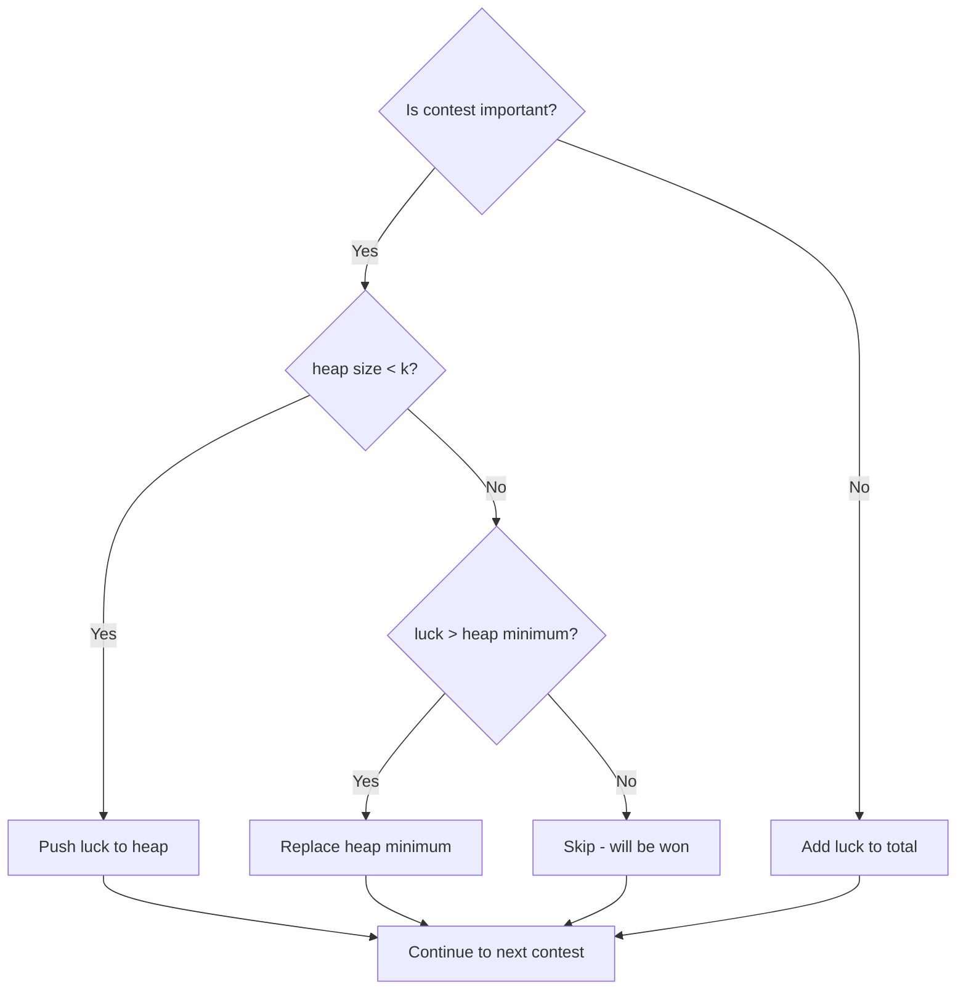

# Luck Balance - Tutorial

## Problem Statement

Lena is preparing for a coding competition. Before the competition, she must attend several preliminary contests. Each contest has a **luck value** and an **importance rating**.

- If Lena **loses** a contest, she gains that contest's luck value
- If Lena **wins** a contest, she loses that luck value
- She can lose at most **k important contests**
- She can lose **all unimportant contests**

**Goal:** Maximize total luck.

**Link:** [HackerRank - Luck Balance](https://www.hackerrank.com/challenges/luck-balance/problem)

---

## Understanding the Problem

| Parameter | Description |
|-----------|-------------|
| `k` | Maximum number of important contests we can lose |
| `importance = 1` | Important contest (limited losses) |
| `importance = 0` | Unimportant contest (can always lose) |
| Lose contest | Gain `+luck` |
| Win contest | Lose `-luck` |

---

## Example Walkthrough

```
k = 3
contests = [(5, 1), (2, 1), (1, 1), (8, 1), (10, 0), (5, 0)]
```

**Step 1:** Separate contests by importance

| Important (imp=1) | Unimportant (imp=0) |
|-------------------|---------------------|
| 8, 5, 2, 1 | 10, 5 |

**Step 2:** Apply greedy strategy

- **Unimportant:** Lose ALL → +10 + 5 = **+15**
- **Important:** Lose TOP 3 (highest luck) → +8 + 5 + 2 = **+15**
- **Important:** Win the rest → -1 = **-1**

**Result:** 15 + 15 - 1 = **29**

---

## The Greedy Insight

To maximize luck:
1. **Lose** contests with the **highest** luck values
2. **Win** contests with the **lowest** luck values (when forced)

This is greedy because we make the locally optimal choice at each step—prioritizing high-luck losses.

---

## Current Solution Analysis

```python
# O(n log n) time complexity due to sorting
def luckBalance(k, contests):
    important_contests = sorted(
        [luck for luck, importance in contests if importance == 1],
        reverse=True
    )
    unimportant_contests = [luck for luck, importance in contests if importance == 0]
    max_luck = sum(unimportant_contests) + sum(important_contests[:k]) - sum(important_contests[k:])
    return max_luck
```

### How It Works

1. Filter and sort important contests by luck (descending)
2. Filter unimportant contests
3. Calculate: `sum(unimportant) + sum(top_k_important) - sum(remaining_important)`

### Complexity

| Metric | Value | Notes |
|--------|-------|-------|
| **Time** | O(n log n) | Dominated by sorting |
| **Space** | O(n) | Two auxiliary lists |

---

## Optimization: Min-Heap Approach

When `k` is small, sorting the entire list is wasteful. We only need the **top k** values.



### Optimized Solution

```python
import heapq

def luckBalance(k, contests):
    """
    Time: O(n log k) - much better when k << n
    Space: O(k) - only stores top k elements
    """
    if k == 0:
        return sum(luck if imp == 0 else -luck for luck, imp in contests)

    min_heap = []
    total_luck = 0
    important_total = 0

    for luck, importance in contests:
        if importance == 0:
            total_luck += luck  # Lose all unimportant
        else:
            important_total += luck
            # Maintain top-k in min-heap
            if len(min_heap) < k:
                heapq.heappush(min_heap, luck)
            elif luck > min_heap[0]:
                heapq.heapreplace(min_heap, luck)

    lose_sum = sum(min_heap)          # Top k we lose
    win_sum = important_total - lose_sum  # Rest we win

    return total_luck + lose_sum - win_sum
```

### Why Min-Heap?

- A **min-heap of size k** keeps the **k largest** values
- The smallest of the top-k is at the root
- When a new value is larger than the root, we replace it
- This gives us O(log k) per insertion instead of O(n log n) for full sort

---

## Complexity Comparison

| Solution | Time | Space | Best When |
|----------|------|-------|-----------|
| Original (sort) | O(n log n) | O(n) | Simple, readable |
| **Min-Heap** | **O(n log k)** | **O(k)** | **k << n** |

---

## Common Mistakes

1. **Sorting when k is small** - Use heap instead
2. **Forgetting k=0** - Must win all important contests
3. **Using max-heap for top-k** - Use min-heap (evict smallest)
4. **Not handling m ≤ k** - Can lose all important contests

---

## Test Cases

```python
# Basic example
assert luckBalance(3, [(5,1), (2,1), (1,1), (8,1), (10,0), (5,0)]) == 29

# Can lose all important
assert luckBalance(4, [(5,1), (2,1), (1,1), (8,1), (10,0), (5,0)]) == 31

# Must win all important (k=0)
assert luckBalance(0, [(5,1), (2,1), (10,0)]) == 3

# No important contests
assert luckBalance(2, [(10,0), (5,0), (3,0)]) == 18
```

---

## Key Takeaways

1. **Greedy pattern:** Maximize by selecting top-k → sort or use heap
2. **Heap vs Sort:** If you only need top-k, heap is O(n log k) vs O(n log n)
3. **Min-heap trick:** To keep top-k largest, use min-heap and evict the smallest
4. **Profile first:** O(n log n) is often fast enough—optimize when needed

---

## Related Problems

- [Minimum Absolute Difference in an Array](https://www.hackerrank.com/challenges/minimum-absolute-difference-in-an-array)
- [Marc's Cakewalk](https://www.hackerrank.com/challenges/marcs-cakewalk)
- [Greedy Florist](https://www.hackerrank.com/challenges/greedy-florist)
