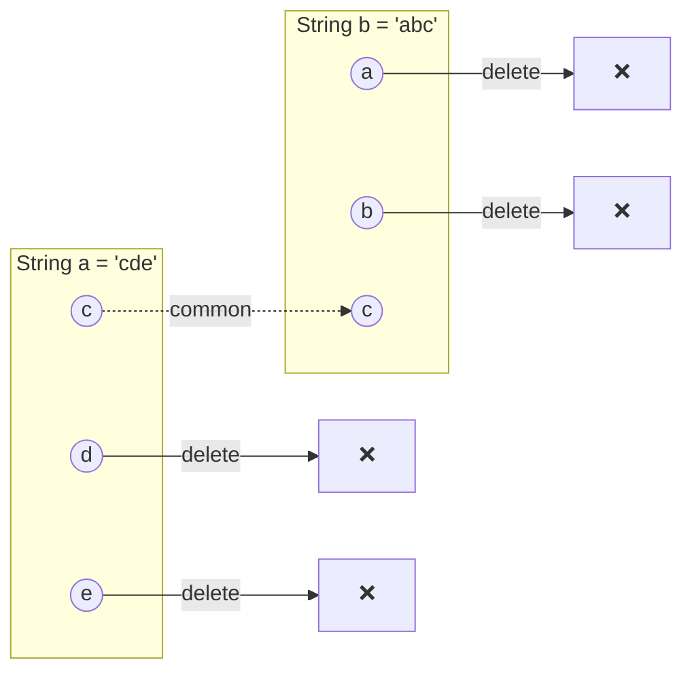
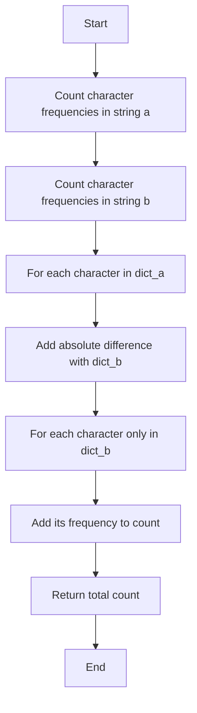
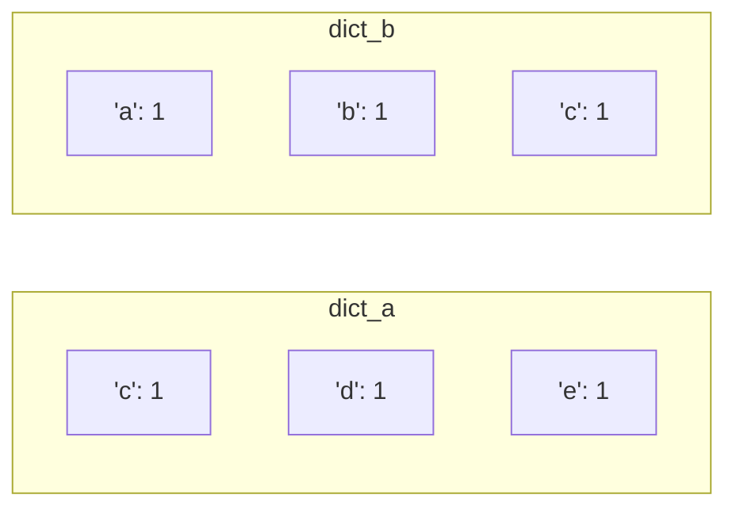
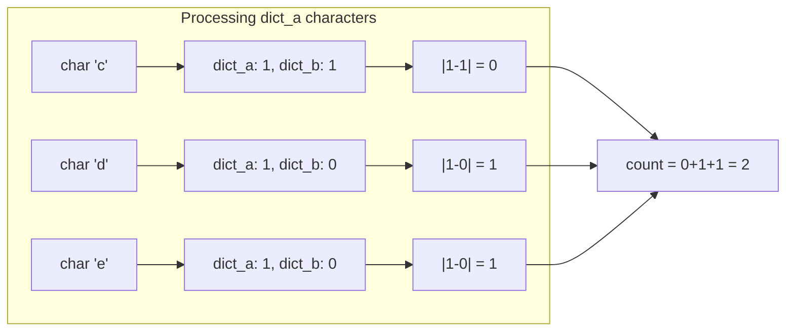
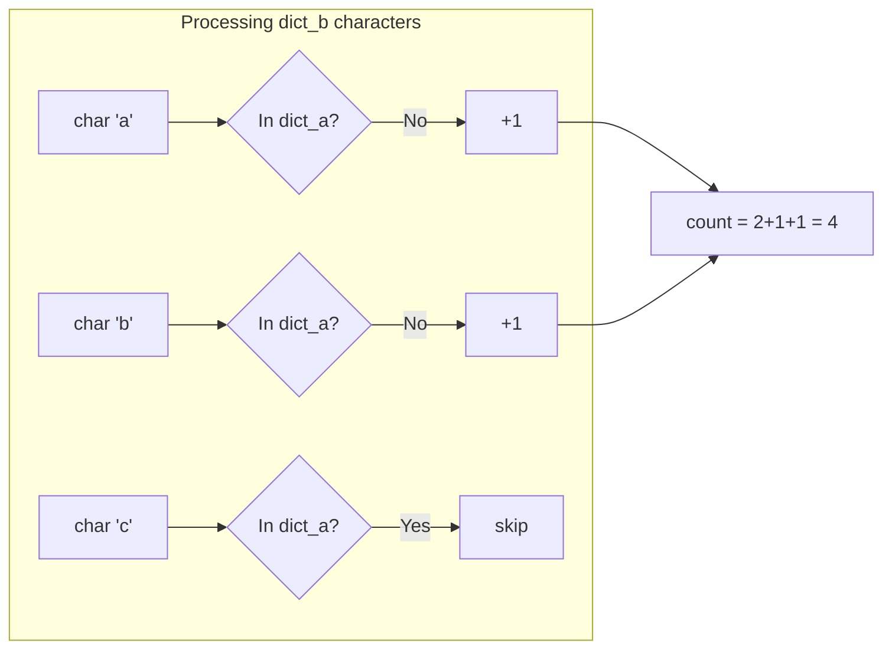
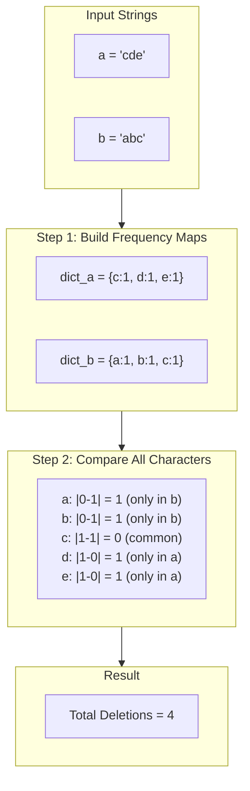
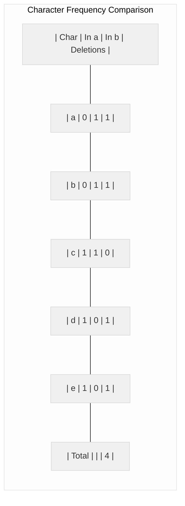
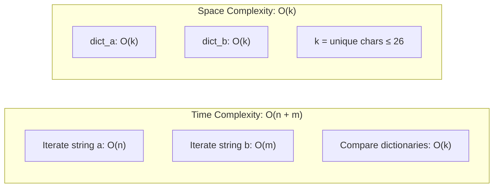
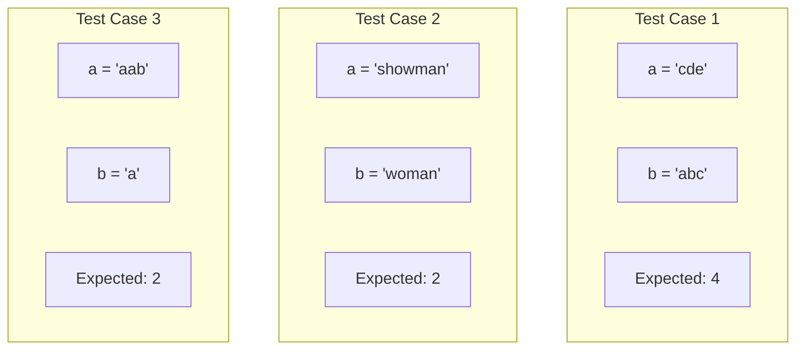
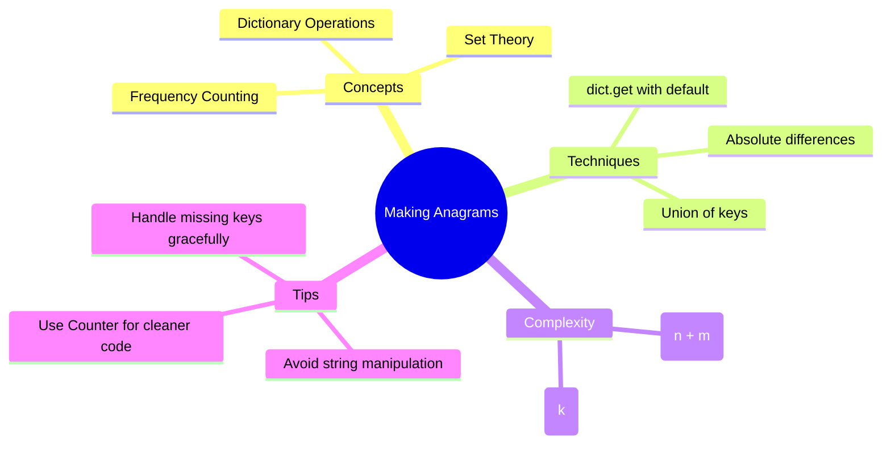

# Making Anagrams - Tutorial

## Problem Statement

Given two strings, `a` and `b`, determine the **minimum number of character deletions** required to make them anagrams of each other.

**Link:** [HackerRank - Making Anagrams](https://www.hackerrank.com/challenges/ctci-making-anagrams/problem)

---

## What is an Anagram?

Two strings are **anagrams** if they contain the same characters with the same frequencies, regardless of order.

**Examples:**
- `"listen"` and `"silent"` → Anagrams ✓
- `"triangle"` and `"integral"` → Anagrams ✓
- `"hello"` and `"world"` → Not anagrams ✗

---

## Understanding the Problem

Given two strings, we need to find how many characters must be **deleted** (from either string) so that the remaining characters form anagrams.

### Example

```
a = "cde"
b = "abc"
```



**Answer:** 4 deletions (d, e from `a` and a, b from `b`)

---

## Solution Approach

### Key Insight

Instead of thinking about which characters to keep, we count the **frequency difference** of each character between both strings.

### Algorithm Overview



---

## Step-by-Step Code Explanation

### Step 1: Build Frequency Dictionaries

```python
dict_a = dict()
dict_b = dict()

for char in a:
    dict_a[char] = dict_a.get(char, 0) + 1

for char in b:
    dict_b[char] = dict_b.get(char, 0) + 1
```

For `a = "cde"` and `b = "abc"`:



### Step 2: Count Differences from String `a`

```python
count = 0
for char in dict_a:
    count += abs(dict_a[char] - dict_b.get(char, 0))
```



### Step 3: Count Characters Only in String `b`

```python
for char in dict_b:
    if char not in dict_a:
        count += dict_b[char]
```



---

## Visual Walkthrough



---

## Character Comparison Table



---

## Complete Solution

```python
def makeAnagram(a, b):
    dict_a = dict()
    dict_b = dict()

    # Count character frequencies in string a
    for char in a:
        dict_a[char] = dict_a.get(char, 0) + 1

    # Count character frequencies in string b
    for char in b:
        dict_b[char] = dict_b.get(char, 0) + 1

    count = 0

    # Count differences for characters in a
    for char in dict_a:
        count += abs(dict_a[char] - dict_b.get(char, 0))

    # Count characters only in b (not in a)
    for char in dict_b:
        if char not in dict_a:
            count += dict_b[char]

    return count
```

---

## Alternative Solution Using Counter

Python's `collections.Counter` simplifies the frequency counting:

```python
from collections import Counter

def makeAnagram(a, b):
    counter_a = Counter(a)
    counter_b = Counter(b)

    # Get all unique characters from both strings
    all_chars = set(counter_a.keys()) | set(counter_b.keys())

    # Sum the absolute differences
    return sum(abs(counter_a[c] - counter_b[c]) for c in all_chars)
```

---

## Complexity Analysis



| Complexity | Value | Explanation |
|------------|-------|-------------|
| **Time**   | O(n + m) | Where `n` = len(a), `m` = len(b). We iterate through each string once |
| **Space**  | O(k) | Where `k` = number of unique characters (at most 26 for lowercase letters) |

---

## Test Cases



```python
# Test Case 1
a = "cde"
b = "abc"
# Expected: 4 (delete 'd', 'e' from a; delete 'a', 'b' from b)

# Test Case 2
a = "showman"
b = "woman"
# Expected: 2 (delete 's', 'h' from a)

# Test Case 3
a = "aab"
b = "a"
# Expected: 2 (delete one 'a' and 'b' from a)
```

---

## Key Takeaways



---

## Related Problems

- [Sherlock and the Valid String](https://www.hackerrank.com/challenges/sherlock-and-valid-string)
- [Common Child](https://www.hackerrank.com/challenges/common-child)
- [Alternating Characters](https://www.hackerrank.com/challenges/alternating-characters)
